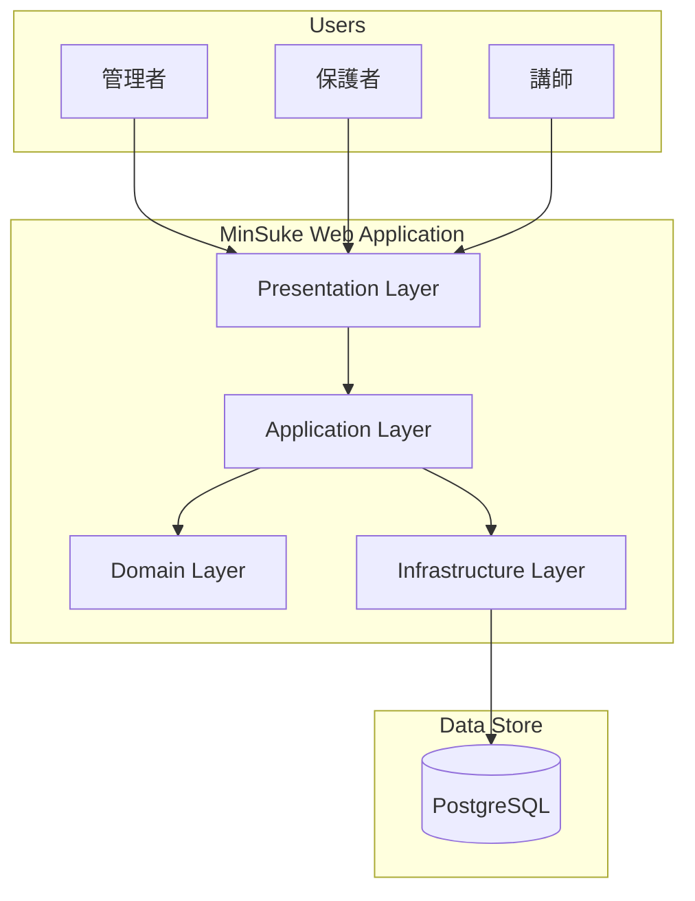
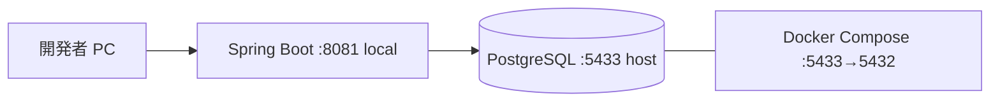

# MinSuke — Architecture

**Status:** Loop 02 **Completed**  
**Date:** 2026-08-11  
**Version:** 0.4

---

## 1. Purpose

MinSuke のシステム構成・技術選定・レイヤー・プロジェクト構成を整理する。

| Loop | 範囲 |
|---|---|
| Loop 01 | 方針比較・基本スタック承認（AD-01〜03） |
| **Loop 02** | **バージョン確定・開発環境・モジュール構成・横断関心事** |
| Loop 04 | プロジェクト生成・実装開始 |

---
## 2. Architecture Principles

| 原則 | 内容 | 区分 |
|---|---|---|
| シンプルさ | 理解しやすいレイヤー・モジュール構成 | Confirmed |
| テスト容易性 | Service 層を中心にユニットテスト可能に | Confirmed |
| 拡張性 | 将来の講師・スケジュール・通知追加を考慮 | Confirmed |
| 過剰設計回避 | MVP に不要なマイクロサービス化等は行わない | Confirmed |
| セキュリティ by Design | 認証・認可を後付けしない | Confirmed |

---

## 3. System Context（Proposed）



---

## 4. Technology Stack

### 4.0 確定スタック（Loop 01 — 2026-08-10）

| レイヤー | 選定 |
|---|---|
| Backend | **Java + Spring Boot** |
| Frontend | **Thymeleaf（SSR）** |
| Database | **PostgreSQL + Spring Data JPA** |
| 構成 | **モノリシック Web アプリケーション** |

### 4.0.1 バージョン・ツール（Loop 02 — **Confirmed 2026-08-11**）

| 項目 | 選定 | 区分 |
|---|---|---|
| **Java** | **21（LTS）** | **Confirmed** |
| **Spring Boot** | **3.5.x**（最新パッチを採用） | **Confirmed** |
| **PostgreSQL** | **16** | **Confirmed** |
| **ビルド** | **Maven** | **Confirmed** |
| **マイグレーション** | **Flyway** | **Confirmed** |
| **ローカル DB** | **Docker Compose** | **Confirmed** |
| **ボイラープレート削減** | **Lombok** | **Confirmed** |
| **テスト** | JUnit 5 + Mockito + Spring Boot Test | **Confirmed** |

**Java 21 を選ぶ理由:** Spring Boot 3.x の推奨 LTS。Java 17 も可だが、サポート期間・エコシステムの観点で 21 を第一候補とする。

**Spring Boot 3.5.x を選ぶ理由:** 2026-08 時点で安定した 3.x 系。3.6+ は採用可だが、パッチ実績のある 3.5.x を MVP 基準とする。

**Maven を選ぶ理由:** 旧 MinSuke 実績、Spring Initializr 標準、IDE（Eclipse / STS）との親和性。

---
## 4.1 Technology Candidates（参考 — 比較記録）

### 4.1 Backend

| 候補 | メリット | デメリット | 評価 |
|---|---|---|---|
| **Java + Spring Boot** | 旧 MinSuke 実績、エコシステム、テスト支援 | ボイラープレート（Lombok 等で緩和） | **Proposed 第一候補** |
| Node.js + Express | 軽量 | チーム Java スキルとの整合 | 参考 |
| Kotlin + Spring Boot | 簡潔な記述 | 学習コスト | Future Consideration |

### 4.2 Frontend

| 候補 | メリット | デメリット | 評価 |
|---|---|---|---|
| **Thymeleaf + HTML/CSS/JS** | SSR、シンプル、旧実績、SEO 不要でも十分 | SPA ほどの動的 UX は限定的 | **Proposed MVP 候補** |
| React + REST API | リッチ UI、分離 | 構成複雑、MVP に過剰の可能性 | Future Consideration |
| Thymeleaf + HTMX | 部分更新、SSR 維持 | 追加学習 | 参考 |

### 4.3 Database

| 候補 | メリット | デメリット | 評価 |
|---|---|---|---|
| **PostgreSQL** | 旧実績、リレーション向き、無料 | 運用必要 | **Proposed 第一候補** |
| MySQL | 普及 | 特段の優位なし | 参考 |
| H2（開発のみ） | ローカル容易 | 本番非推奨 | 開発用 |

### 4.4 ORM / Data Access

| 候補 | 評価 |
|---|---|
| Spring Data JPA | Proposed（旧実績、SQL 削減） |
| MyBatis | SQL 明示制御が必要な場合の代替 |

---

## 5. Proposed Architecture（MVP）

### 5.1 構成概要

**モノリシック Web アプリケーション**（単一デプロイ単位）

```
Browser
   ↓ HTTP
Spring MVC (Controller)
   ↓
Service（業務ロジック）
   ↓
Repository（JPA）
   ↓
PostgreSQL
```

### 5.2 Layer Responsibilities

| レイヤー | 責務 | 例 |
|---|---|---|
| **Controller** | HTTP 受付、バリデーション起動、View 選択 | `EventController` |
| **Service** | 業務ルール、トランザクション境界 | 定員チェック、参加登録 |
| **Repository** | 永続化 | `EventRepository` |
| **Entity** | DB テーブル対応 | `Event`, `Household` |
| **DTO** | 画面・API 用データ転送 | `EventDetailDTO` |

### 5.3 Module Boundaries（Loop 02 — Confirmed）

**ベースパッケージ:** `com.minsuke`

```
com.minsuke
├── MinsukeApplication.java
├── config              … WebMvc, Security, Flyway, GlobalModelAttributes
├── auth
│   ├── controller
│   ├── service
│   ├── repository
│   └── dto
├── family
│   ├── controller      … Household, Parent, Child, FamilyCard
│   ├── service
│   ├── repository
│   ├── entity
│   └── dto
├── event
│   ├── controller      … Event, Calendar, Attendance
│   ├── service
│   ├── repository
│   ├── entity
│   └── dto
├── instructor          … Loop 08（Proposed）
│   ├── controller
│   ├── service
│   ├── repository
│   ├── entity
│   └── dto
└── common
    ├── exception       … GlobalExceptionHandler
    └── util
```

**AD-04:** カレンダーは `event` モジュールに含める。独立 `calendar` パッケージは作らない。**Approved 2026-08-11**  
（理由: events と同一データソース、MVP のモジュール数削減）

**AD-09（Approved 2026-08-12）:** 講師は独立モジュール `instructor` とする。イベント／スケジュールへの割当と稼働可視化は Loop 09（DD-08）。

| 理由 | 内容 |
|---|---|
| 境界 | マスタ CRUD とスケジュール／イベント割当を分離 |
| 依存 | Loop 08 時点では他モジュールへの FK なし |
| 将来 | Loop 09 で event/schedule → instructor 参照＋稼働（FR-I05 / FR-I06） |

### 5.4 レイヤー内の責務ルール

| ルール | 内容 |
|---|---|
| Controller → Service のみ | Repository を Controller から直接呼ばない |
| Service → Repository | トランザクション境界は Service |
| Entity の露出禁止 | Controller は DTO のみ返す |
| 認可チェック | Service 層で household_id / role を検証（Loop 05 で Security 統合） |

---
## 6. API Strategy

### Proposed（MVP）

- **サーバーサイドレンダリング（SSR）** を主とする
- REST API は MVP では最小限（将来 SPA 化時に拡張）
- URL 設計は RESTful 風に整理（旧 MinSuke 改善点として README に記載）

### URL 設計方針（案）

| パターン | 例 |
|---|---|
| リソース一覧 | `GET /families` |
| リソース詳細 | `GET /families/{id}` |
| 作成フォーム | `GET /events/new` |
| 作成 POST | `POST /events` |
| 編集フォーム | `GET /events/{id}/edit`（Loop 09 案） |
| 編集 POST | `POST /events/{id}/edit`（Loop 09 案） |
| 参加登録 | `POST /events/{id}/attend` |
| 講師稼働 | 講師詳細内セクション（追加 URL なし案） |
| 講師一覧 | `GET /instructors`（Loop 08） |
| 講師作成 | `GET/POST /instructors/new`（ADMIN） |
| 講師編集 | `GET/POST /instructors/{id}/edit`（ADMIN） |
| 講師削除 | `POST /instructors/{id}/delete`（ADMIN） |
| お知らせ一覧 | `GET /announcements`（Loop 10） |
| お知らせ詳細 | `GET /announcements/{id}`（Loop 10） |
| お知らせ作成 | `GET/POST /announcements/new`（ADMIN） |

---

## 7. Cross-Cutting Concerns

| 関心事 | 方針 | Loop |
|---|---|---|
| 認証・認可 | **Spring Security**（Interceptor は採用しない） | 依存追加: Loop 04 / 本格実装: Loop 05 |
| バリデーション | Bean Validation（`jakarta.validation`） | Loop 04〜 |
| 例外処理 | `@ControllerAdvice` + エラー画面 | Loop 04 |
| ログ | SLF4J + Logback | Loop 04 |
| 設定 | `application.yml` + プロファイル（`local`, `test`） | Loop 04 |
| DB マイグレーション | **Flyway**（`src/main/resources/db/migration`） | Loop 04 |
| CSRF | Spring Security 標準（Loop 05 以降有効） | Loop 05 |

### 7.1 Spring Security 導入方針（OQ-09 回答）

| フェーズ | 内容 |
|---|---|
| **Loop 04** | `spring-boot-starter-security` を依存に追加。開発用に `permitAll` の最小 `SecurityFilterChain` を配置し、他機能の実装を阻害しない |
| **Loop 05** | フォームログイン、ロールベース認可、CSRF、セッション管理を本格実装 |
| **不採用** | 旧 MinSuke の Interceptor ベース認証 |

**理由:** セキュリティ by Design。後から Security へ移行するコストを避け、CSRF・認可を一貫して管理する。

---
## 8. Development Environment（Loop 02）

### 8.1 ローカル開発構成（Proposed）



| コンポーネント | 方針 |
|---|---|
| アプリ | IDE または `mvn spring-boot:run -Dspring-boot.run.profiles=local` |
| ポート | **8081**（`application-local.yml`）。デフォルト `application.yml` は 8080 |
| DB | **Docker Compose** で PostgreSQL 16 を起動 |
| 接続 | `application-local.yml` — `localhost:5433`（ホスト PG が 5432 使用時） |
| 初期データ | Flyway `V1__` スキーマ + `dev` プロファイル seed（Loop 04） |
| 初回セットアップ | `application-local.yml.example` をコピーして `application-local.yml` を作成 |

### 8.2 Docker Compose（案）

```yaml
# docker-compose.yml（Loop 04 で作成）
services:
  postgres:
    image: postgres:16-alpine
    ports:
      - "5433:5432"
    environment:
      POSTGRES_DB: minsuke
      POSTGRES_USER: minsuke
      POSTGRES_PASSWORD: minsuke
    volumes:
      - minsuke_pg_data:/var/lib/postgresql/data
```

> 本番用 Compose / デプロイは OQ-07（未確定）。Loop 02 ではローカル開発のみ対象。

### 8.3 設定管理

| 種別 | 保管場所 | 例 |
|---|---|---|
| 非機密デフォルト | `application.yml` | JPA 設定（ポート 8080） |
| ローカルテンプレート | `application-local.yml.example` | コピー元（リポジトリに含む） |
| ローカル上書き | `application-local.yml`（gitignore） | ポート 8081、DB 接続、dev seed |
| 機密 | 環境変数 | `SPRING_DATASOURCE_PASSWORD` |
| テスト | `application-test.yml` | Flyway V1 のみ（seed なし） |

**テスト実行（Testcontainers）:** 統合テストは PostgreSQL コンテナを使用する。`@Testcontainers(disabledWithoutDocker = true)` により **Docker 未起動時は DB テストをスキップ**する。CI では Docker サービスを有効にすること（Loop 12 で方針確定予定）。

### 8.4 主要依存関係（Loop 04 予定）

| 依存 | 用途 |
|---|---|
| `spring-boot-starter-web` | MVC |
| `spring-boot-starter-thymeleaf` | SSR |
| `spring-boot-starter-data-jpa` | ORM |
| `spring-boot-starter-validation` | Bean Validation |
| `spring-boot-starter-security` | 認証・認可（Loop 05 で本格化） |
| `postgresql` | JDBC ドライバ |
| `flyway-core` | マイグレーション |
| `lombok` | ボイラープレート削減（optional） |
| `spring-boot-starter-test` | テスト |

---
## 9. Architecture Decisions

### AD-01: モノリスを採用（Proposed）

| 項目 | 内容 |
|---|---|
| Decision | MVP はモノリシック Web アプリ |
| Reason | チーム規模・MVP 範囲に対しマイクロサービスは過剰 |
| Alternative | マイクロサービス、BFF + SPA |
| Why rejected | 運用・開発コストが MVP に不針合 |
| Impact | 単一リポジトリ・単一デプロイで開始 |
| Approved | **Yes**（2026-08-10） |

### AD-02: Thymeleaf SSR（Proposed）

| 項目 | 内容 |
|---|---|
| Decision | MVP フロントは Thymeleaf |
| Reason | 旧実績、学習コスト低、MVP 機能に十分 |
| Alternative | React SPA |
| Why rejected | MVP 段階では構成が複雑化 |
| Impact | Controller が View を返す MVC 構成 |
| Approved | **Yes**（2026-08-10） |

### AD-03: PostgreSQL + JPA（Proposed）

| 項目 | 内容 |
|---|---|
| Decision | PostgreSQL + Spring Data JPA |
| Reason | 旧実績、リレーション中心のドメインに適合 |
| Alternative | MyBatis, NoSQL |
| Why rejected | MVP ドメインはリレーショナルが自然 |
| Impact | Entity 設計が DB スキーマの基盤 |
| Approved | **Yes**（2026-08-10） |

### AD-04: カレンダーを event モジュールに統合

| 項目 | 内容 |
|---|---|
| Decision | カレンダー表示は `event` パッケージ内に配置 |
| Reason | 同一データソース（events）、MVP のモジュール数削減 |
| Alternative | 独立 `calendar` パッケージ |
| Why rejected | MVP 段階では過剰な分割 |
| Impact | `CalendarController` / `CalendarService` は `event` 配下 |
| Approved | **Yes**（2026-08-11） |

### AD-05: Java 21 + Spring Boot 3.5.x

| 項目 | 内容 |
|---|---|
| Decision | Java 21 LTS、Spring Boot 3.5.x |
| Reason | Spring Boot 3.x 推奨、長期サポート、旧 MinSuke（Java/Spring）との連続性 |
| Alternative | Java 17、Spring Boot 3.6+ |
| Why rejected | Java 21 が現行 LTS 標準。3.6+ はパッチ実績が浅い可能性 |
| Impact | `pom.xml` の `java.version`、Spring Boot parent |
| Approved | **Yes**（2026-08-11） |

### AD-06: Flyway によるスキーマ管理

| 項目 | 内容 |
|---|---|
| Decision | Flyway を Loop 04 から導入 |
| Reason | バージョン管理された SQL、チーム開発・CI で再現可能 |
| Alternative | Liquibase、`ddl-auto=update` |
| Why rejected | `ddl-auto` は本番非推奨。Flyway は Spring Boot 標準統合 |
| Impact | `db/migration/V1__*.sql` 形式 |
| Approved | **Yes**（2026-08-11） |

### AD-07: Docker Compose を標準ローカル環境とする

| 項目 | 内容 |
|---|---|
| Decision | ローカル PostgreSQL は Docker Compose で提供 |
| Reason | 環境差異の削減、PostgreSQL 16 の手軽な起動 |
| Alternative | ローカルインストール PostgreSQL、H2 |
| Why rejected | H2 は本番との差異。手動インストールは環境ばらつき |
| Impact | リポジトリルートに `docker-compose.yml` |
| Approved | **Yes**（2026-08-11） |

### AD-08: Maven ビルド

| 項目 | 内容 |
|---|---|
| Decision | Maven + Maven Wrapper |
| Reason | 旧 MinSuke 実績、STS / Eclipse 親和性 |
| Alternative | Gradle |
| Why rejected | 学習コスト・既存知見を優先 |
| Impact | `pom.xml`, `mvnw` |
| Approved | **Yes**（2026-08-11） |

---

## 10. Open Questions

| # | 質問 | 状態 | 備考 |
|---|---|---|---|
| OQ-09 | Spring Security 導入タイミング | ✅ Loop 04 依存 / Loop 05 本格化 | §7.1 |
| OQ-12 | 初回 ADMIN 作成 | ✅ Confirmed | §11.1 |
| OQ-07 | 本番デプロイ先 | Open | Loop 04 以降 |

### 11.1 初回 ADMIN 作成方針（OQ-12 — Confirmed 2026-08-11）

| 項目 | 方針 |
|---|---|
| 公開登録 | 常に **PARENT** ロールで作成 |
| 初回 ADMIN | **Flyway seed**（`dev` / `local` プロファイル）または環境変数で 1 件投入 |
| 本番 | デプロイ時に管理者アカウントを手動 seed（Open — 運用方針に依存） |

---
## 11. Related Documents

- `requirements.md` — 機能要件・MVP
- `database.md` — データモデル候補
- `security.md` — 認証・認可方針
- `ui.md` — 画面・UX 方針
