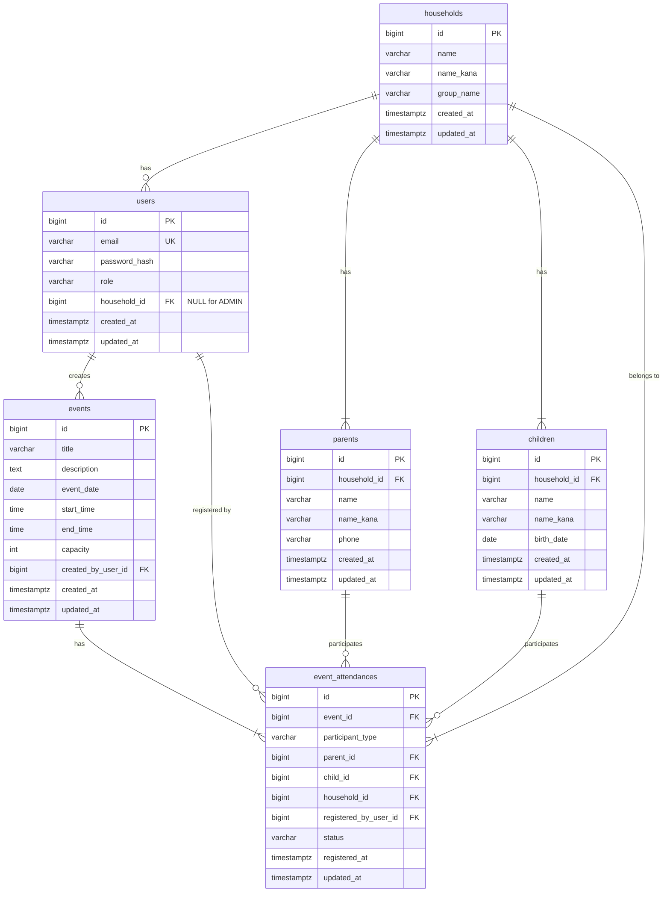

# MinSuke — Database Design

**Status:** Loop 03 **Completed**  
**Date:** 2026-08-11  
**Version:** 1.1

> Loop 03 では **ER 確定・テーブル定義・制約・Flyway SQL 設計** まで。DB 構築・マイグレーション実行は Loop 04。

---

## 1. Design Principles

| 原則 | 内容 | Loop 03 |
|---|---|---|
| 正規化 | 第 3 正規形を基本 | Confirmed |
| 命名 | スネークケース、テーブルは複数形 | Confirmed |
| PK | `BIGSERIAL` サロゲートキー | Confirmed |
| 監査 | `created_at`, `updated_at`（`TIMESTAMPTZ`） | Confirmed |
| 論理削除 | **`deleted_at` は MVP に導入しない**（DD-01） | **Confirmed** |
| 参加キャンセル | `event_attendances.status = CANCELLED` で表現 | Confirmed |
| 履歴テーブル | MVP 外（DD-02） | **Confirmed** |
| 暗号化 | DB カラム暗号化は MVP 外（DD-03） | **Confirmed** |

---

## 2. DB Product

| 項目 | 選定 |
|---|---|
| RDBMS | **PostgreSQL 16** |
| マイグレーション | **Flyway** |
| JPA `ddl-auto` | **`validate`** |

---

## 3. MVP ER Diagram（Loop 03 — Confirmed）



---

## 4. Table Definitions（MVP）

### 4.1 households

| カラム | 型 | NULL | 制約 | 説明 |
|---|---|---|---|---|
| id | BIGSERIAL | NO | PK | |
| name | VARCHAR(100) | NO | | 家族名 |
| name_kana | VARCHAR(100) | NO | | ふりがな |
| group_name | VARCHAR(50) | YES | | 班名等 |
| created_at | TIMESTAMPTZ | NO | DEFAULT now() | |
| updated_at | TIMESTAMPTZ | NO | DEFAULT now() | |

### 4.2 users

| カラム | 型 | NULL | 制約 | 説明 |
|---|---|---|---|---|
| id | BIGSERIAL | NO | PK | |
| email | VARCHAR(255) | NO | UNIQUE | ログイン ID |
| password_hash | VARCHAR(255) | NO | | BCrypt |
| role | VARCHAR(20) | NO | CHECK `ADMIN`,`PARENT` | |
| household_id | BIGINT | YES | FK → households | **ADMIN は NULL** |
| created_at | TIMESTAMPTZ | NO | DEFAULT now() | |
| updated_at | TIMESTAMPTZ | NO | DEFAULT now() | |

**CHECK 制約（DD-04）:**

- `role = 'ADMIN'` → `household_id IS NULL`
- `role = 'PARENT'` → `household_id IS NOT NULL`

### 4.3 parents

| カラム | 型 | NULL | 制約 | 説明 |
|---|---|---|---|---|
| id | BIGSERIAL | NO | PK | |
| household_id | BIGINT | NO | FK → households ON DELETE CASCADE | |
| name | VARCHAR(100) | NO | | |
| name_kana | VARCHAR(100) | NO | | |
| phone | VARCHAR(20) | YES | | 連絡先 |
| created_at | TIMESTAMPTZ | NO | DEFAULT now() | |
| updated_at | TIMESTAMPTZ | NO | DEFAULT now() | |

### 4.4 children

| カラム | 型 | NULL | 制約 | 説明 |
|---|---|---|---|---|
| id | BIGSERIAL | NO | PK | |
| household_id | BIGINT | NO | FK → households ON DELETE CASCADE | |
| name | VARCHAR(100) | NO | | |
| name_kana | VARCHAR(100) | NO | | |
| birth_date | DATE | YES | | |
| created_at | TIMESTAMPTZ | NO | DEFAULT now() | |
| updated_at | TIMESTAMPTZ | NO | DEFAULT now() | |

### 4.5 events

| カラム | 型 | NULL | 制約 | 説明 |
|---|---|---|---|---|
| id | BIGSERIAL | NO | PK | |
| title | VARCHAR(200) | NO | | |
| description | TEXT | NO | | |
| event_date | DATE | NO | | カレンダー表示基準日 |
| start_time | TIME | YES | | |
| end_time | TIME | YES | | start ≤ end |
| capacity | INT | YES | CHECK > 0 or NULL | NULL = 定員なし |
| created_by_user_id | BIGINT | NO | FK → users | ADMIN |
| created_at | TIMESTAMPTZ | NO | DEFAULT now() | |
| updated_at | TIMESTAMPTZ | NO | DEFAULT now() | |

### 4.6 event_attendances

| カラム | 型 | NULL | 制約 | 説明 |
|---|---|---|---|---|
| id | BIGSERIAL | NO | PK | |
| event_id | BIGINT | NO | FK → events ON DELETE RESTRICT | |
| participant_type | VARCHAR(10) | NO | CHECK `PARENT`,`CHILD` | |
| parent_id | BIGINT | YES | FK → parents ON DELETE RESTRICT | PARENT 参加時必須 |
| child_id | BIGINT | YES | FK → children ON DELETE RESTRICT | CHILD 参加時必須 |
| household_id | BIGINT | NO | FK → households ON DELETE RESTRICT | 認可用 |
| registered_by_user_id | BIGINT | NO | FK → users ON DELETE RESTRICT | 操作した保護者 |
| status | VARCHAR(20) | NO | DEFAULT `REGISTERED` | `REGISTERED`,`CANCELLED` |
| registered_at | TIMESTAMPTZ | NO | DEFAULT now() | 初回登録日時 |
| updated_at | TIMESTAMPTZ | NO | DEFAULT now() | キャンセル日時等 |

**参加者 CHECK:**

```
(participant_type = 'PARENT' AND parent_id NOT NULL AND child_id NULL)
OR
(participant_type = 'CHILD' AND child_id NOT NULL AND parent_id NULL)
```

**部分 UNIQUE インデックス（REGISTERED のみ）:**

- `(event_id, parent_id)` WHERE `parent_id IS NOT NULL AND status = 'REGISTERED'`
- `(event_id, child_id)` WHERE `child_id IS NOT NULL AND status = 'REGISTERED'`

> キャンセル後の再登録を許可するため、UNIQUE は `REGISTERED` に限定する。

---

## 5. Relationships & FK Policy

| FK | ON DELETE | 理由 |
|---|---|---|
| users.household_id → households | RESTRICT | 家庭削除前にユーザー解除が必要 |
| parents/children → households | CASCADE | 家庭削除時にプロフィールも削除（PD-01） |
| events.created_by → users | RESTRICT | 作成者削除前にイベント処理が必要 |
| event_attendances → events | RESTRICT | 参加者がいるイベントは削除不可 |
| event_attendances → parents/children | RESTRICT | 参加履歴保護 |
| event_attendances → households | RESTRICT | 認可参照の整合性 |

---

## 6. Index Strategy

| テーブル | インデックス | 種別 | 理由 |
|---|---|---|---|
| users | email | UNIQUE | ログイン |
| users | household_id | INDEX | 家庭別ユーザー検索 |
| parents | household_id | INDEX | 家庭詳細 |
| children | household_id | INDEX | 家庭詳細 |
| events | event_date | INDEX | カレンダー月間検索 |
| event_attendances | event_id | INDEX | 参加者一覧 |
| event_attendances | household_id | INDEX | 家庭別参加 |
| event_attendances | (event_id, parent_id) | UNIQUE partial | 重複防止 |
| event_attendances | (event_id, child_id) | UNIQUE partial | 重複防止 |

---

## 7. Data Integrity Rules

| ルール | 実装 |
|---|---|
| 定員超過防止 | Service: `COUNT(*) WHERE status='REGISTERED'` < capacity |
| 自家庭以外の参加禁止 | Service + Authorization: `household_id` 一致 |
| パスワード平文禁止 | Service: BCrypt のみ保存 |
| ADMIN の household_id | DB CHECK + アプリ検証 |
| イベント削除 | REGISTERED 参加が存在する場合は RESTRICT で拒否 |

### 7.1 定員カウント SQL（参考）

```sql
SELECT COUNT(*) FROM event_attendances
WHERE event_id = :eventId AND status = 'REGISTERED';
```

---

## 8. Delete Policy（DD-01 — Confirmed 2026-08-11）

| 対象 | 方式 | 理由 |
|---|---|---|
| households / parents / children / users | **物理削除** | PD-01（選択肢 B）と整合。`deleted_at` 不要 |
| event_attendances キャンセル | **status = CANCELLED**（行は残す） | 参加履歴・再登録制御。論理削除カラムは使わない |
| event_attendances 行削除 | MVP では行わない | 履歴保持 |
| イベント削除 | 物理削除（参加者なし時のみ） | RESTRICT で保護 |

---

## 9. Migration Strategy

| 項目 | 内容 |
|---|---|
| ツール | Flyway |
| 設計 SQL | `docs/database/V1__create_schema.sql` |
| dev seed | `docs/database/V2__seed_dev.sql`（Loop 04 で profile 分離） |
| Loop 04 配置 | `src/main/resources/db/migration/` へコピー |
| `ddl-auto` | `validate` |

### 9.1 マイグレーションファイル一覧（設計）

| ファイル | 内容 | 適用 |
|---|---|---|
| `V1__create_schema.sql` | 全テーブル・制約・インデックス | 全環境 |
| `V2__seed_dev.sql` | ADMIN・サンプル家庭・イベント | dev/local のみ |

> seed のパスワードハッシュは Loop 04/05 で `PasswordEncoder` により再生成する。

---

## 10. Database Decisions

### DD-01: 論理削除カラムは MVP に導入しない

| 項目 | 内容 |
|---|---|
| Decision | `deleted_at` なし。プロフィールは物理削除、参加は status で管理 |
| Reason | PD-01 と整合、スキーマ単純化 |
| Alternative | 全テーブルに `deleted_at` |
| Why rejected | MVP でクエリ複雑化、保持ポリシーと二重管理 |
| Approved | **Yes**（2026-08-11） |

### DD-02: 監査ログテーブルは MVP 外

| 項目 | 内容 |
|---|---|
| Decision | `audit_log` テーブルは作らない |
| Reason | `created_at` / `updated_at` で十分 |
| Approved | **Yes**（2026-08-11） |

### DD-03: DB カラム暗号化は MVP 外

| 項目 | 内容 |
|---|---|
| Decision | 氏名・電話は平文保存。アクセス制御で保護 |
| Reason | MVP 規模では過剰。PostgreSQL TDE 等は本番運用時に検討 |
| Approved | **Yes**（2026-08-11） |

### DD-04: users の role と household_id 整合 CHECK

| 項目 | 内容 |
|---|---|
| Decision | DB レベル CHECK 制約で ADMIN/PARENT の household 規則を強制 |
| Reason | データ整合性の最終防衛線 |
| Approved | **Yes**（2026-08-11） |

### DD-05: 参加重複防止は部分 UNIQUE インデックス

| 項目 | 内容 |
|---|---|
| Decision | REGISTERED のみ UNIQUE。CANCELLED 後は再登録可 |
| Reason | キャンセル→再参加の業務フローに対応 |
| Approved | **Yes**（2026-08-11） |

---

## 11. Entity ↔ Table Mapping（Loop 04 参考）

| JPA Entity（案） | テーブル | モジュール |
|---|---|---|
| `User` | users | auth |
| `Household` | households | family |
| `Parent` | parents | family |
| `Child` | children | family |
| `Event` | events | event |
| `EventAttendance` | event_attendances | event |

---

## 12. Open Questions

| # | 質問 | 状態 |
|---|---|---|
| DQ-01 | 参加単位 | ✅ 個別 |
| DQ-02 | 論理削除 vs 物理削除 | ✅ **DD-01**（物理削除 + status） |
| DQ-03 | イベントとスケジュール同一テーブル | Open（Post-MVP） |
| DQ-04 | 監査ログ MVP 含有 | ✅ **DD-02**（含まない） |
| DQ-05 | 個人情報暗号化 | ✅ **DD-03**（MVP 外） |
| DQ-06 | 保持期間・削除 | ✅ 選択肢 B |

---

## 13. Reference

- `docs/database/V1__create_schema.sql` — Flyway 設計 SQL
- `docs/database/V2__seed_dev.sql` — 開発 seed 設計
- `requirements.md` — FR 対応
- `architecture.md` — Flyway / PostgreSQL 方針
- `security.md` — SD-03 初回 ADMIN seed
