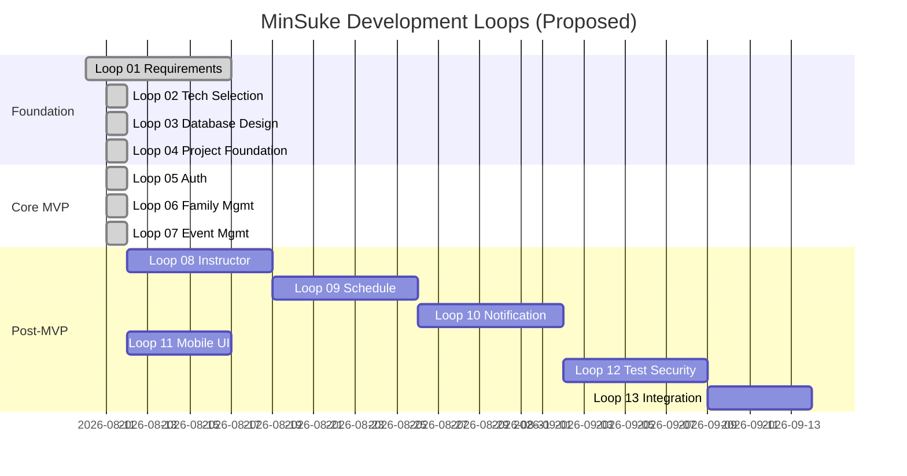

# MinSuke — Development Roadmap

**Status:** Loop 15 **Complete** — FR-S04 シリーズ一括参加（PR **#10** merge）  
**Date:** 2026-08-15  
**Version:** 1.11

---

## 1. Roadmap Overview

Loop 01 の成果を踏まえ、Loop 02 以降の開発計画案を示す。  
順序・内容は Loop 01 完了時に確定する。

> 期間は目安。実際のスケジュールは未確定。

---

## 2. Loop Summary

| Loop | 名称 | 目的 | 実装 |
|---|---|---|---|
| **01** | Requirements & Basic Design | 要件・MVP・アーキテクチャ方針 | なし |
| **02** | Architecture & Tech Selection | 技術スタック最終決定 | なし |
| **03** | Database Design | ER 確定、マイグレーション設計 | なし |
| **04** | Project Foundation | Spring Boot 生成、CI、DB 接続 | あり |
| **05** | Authentication & Authorization | 登録・ログイン・ロール | あり |
| **06** | Family Management | 家庭・保護者・子ども | あり |
| **07** | Event Management | イベント・カレンダー・参加 | あり |
| **08** | Instructor Management | 講師マスタ | あり |
| **09** | Schedule Management | スケジュール・割当・**イベント講師・稼働可視化**（FR-I05/I06, OQ-03） | あり |
| **10** | Notification | お知らせ・配信 | あり |
| **11** | Schedule Management | 定期・単発スケジュール（FR-S01）・複数曜日 | あり |
| **12** | Participation Unit | 参加登録単位（FR-S03: 家庭/保護者/子ども） | あり |
| **13** | My Participation | 自家庭の参加可視化（FR-E06: カレンダー色・本日参加） | あり |
| **14** | Mobile UI | スマートフォンでの主要操作（NFR-02） | あり |
| **15** | Bulk Attend | 同じスケジュールの今後イベントへ一括参加（FR-S04 最小） | あり |

---

## 3. MVP Boundary

**MVP = Loop 04 〜 Loop 07**（Proposed）

| 含む | 含まない |
|---|---|
| プロジェクト基盤 | 講師管理（Loop 08） |
| 認証・認可（基本） | スケジュール（Loop 09） |
| 家庭管理 | 通知（Loop 10） |
| イベント・カレンダー・参加 | |

MVP 完了時点で旧 MinSuke Spring Boot 版と同等以上の価値を提供することを目標とする。

---

## 4. Loop 01 Deliverables Checklist

| 項目 | 状態 |
|---|---|
| requirements.md | ✅ Draft |
| architecture.md | ✅ Draft |
| database.md | ✅ Draft |
| security.md | ✅ Draft |
| ui.md | ✅ Draft |
| development-roadmap.md | ✅ Draft |
| minutes.md 更新 | 進行中 |
| Open Questions 整理 | ✅ |
| 人間承認（MVP・技術選定） | ✅ 2026-08-10 承認済 |
| 人間承認（個人情報ポリシー OQ-05） | ✅ 選択肢 B（2026-08-11） |

---

## 5. Loop 03 Scope（完了 — 2026-08-11）

| 項目 | 状態 |
|---|---|
| ER 図確定（6 テーブル） | ✅ |
| 全テーブルカラム定義 | ✅ `database.md` v1.1 |
| FK / ON DELETE 方針 | ✅ |
| 削除ポリシー DD-01 | ✅ **Approved** |
| 監査ログ DD-02 | ✅ **Approved**（MVP 外） |
| 暗号化 DD-03 | ✅ **Approved**（MVP 外） |
| CHECK / 部分 UNIQUE DD-04, DD-05 | ✅ **Approved** |
| Flyway SQL 設計 | ✅ `docs/database/` |

---

## 6. Loop 02 Scope（完了 — 2026-08-11）

| 項目 | 状態 |
|---|---|
| Java 21 + Spring Boot 3.5.x | ✅ **Approved**（AD-05） |
| Maven ビルド | ✅ **Approved**（AD-08） |
| Flyway | ✅ **Approved**（AD-06） |
| Docker Compose（ローカル PG） | ✅ **Approved**（AD-07） |
| Spring Security タイミング | ✅ Loop 04 依存 / Loop 05 本格化 |
| パッケージ構成 `com.minsuke` | ✅ **Approved** |
| カレンダー → event 統合 | ✅ **Approved**（AD-04） |
| 初回 ADMIN 方針（OQ-12） | ✅ **Approved** |

---

## 6. Loop 01 → Loop 02 Handoff（完了）

Loop 02 で決定すべき事項：

1. ~~Spring Boot / Java バージョン確定~~ → AD-05 Proposed
2. ~~Thymeleaf vs 代替の最終判断~~ → Loop 01 で確定済
3. ~~PostgreSQL + JPA 確定~~ → Loop 01 で確定済
4. ~~Spring Security 導入タイミング~~ → OQ-09 確定
5. ~~Flyway 等マイグレーションツール~~ → AD-06 Proposed
6. ~~開発環境（Docker Compose 等）~~ → AD-07 Proposed

---

## 7. Testing Roadmap（概要）

| Loop | テスト重点 |
|---|---|
| 04 | プロジェクト起動、Smoke Test |
| 05 | 認証・認可の Security Test |
| 06-07 | Service Unit Test、Controller Test |
| 12 | E2E、カバレッジ目標設定 |

**Testcontainers 方針（2026-08-11）:**

- 統合テストは PostgreSQL 16 コンテナを使用（`@Testcontainers(disabledWithoutDocker = true)`）
- ローカルで Docker 未起動の場合、DB 依存テストは**スキップ**され `mvnw test` は成功する
- **CI では Docker を有効化**すること。未設定だと DB テストが実行されずカバレッジが不足する
- H2 への切り替えは採用しない（PostgreSQL 固有制約・Flyway 整合のため）

詳細は Loop 12 前に `testing.md` を検討。

---

## 7. Risks & Mitigations

| リスク | 対策 |
|---|---|
| MVP 肥大化 | requirements.md の MVP 境界を厳守 |
| 技術選定の先延ばし | Loop 02 で 1 週間以内に決定 |
| セキュリティ後付け | Loop 05 を MVP に含める |
| 旧コードの暗黙的移植 | 設計書ベースの新規実装 |

---

## 8. Next Actions

1. 次 Loop の対象を決める（候補: FR-E05 参加履歴 / Testing・CI）
2. 人間承認後に実装ブランチを切る

---

## 9. Related Documents

- `minutes.md` — 意思決定・Loop 履歴
- `Composer.md` — Loop ルール
- `roles.md` — 専門家ロール
