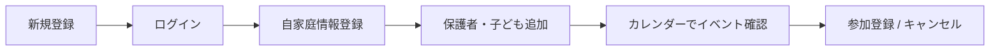
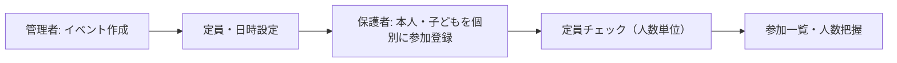
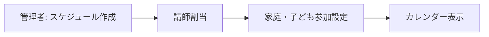
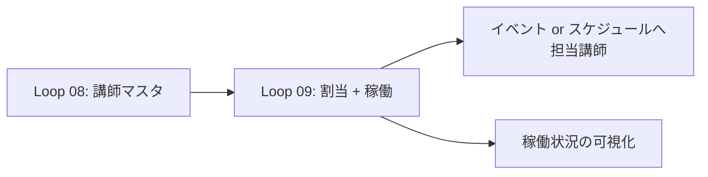

# MinSuke — Requirements (Loop 01 Draft)

**Status:** Draft — Loop 01 In Progress  
**Date:** 2026-08-11  
**Version:** 0.3

---

## 1. Document Classification

本書では要件を以下の区分で記載する。

| 区分 | 意味 |
|---|---|
| **Confirmed** | プロジェクト方針・既存文書で確認済み |
| **Proposed** | 調査に基づく提案。人間の承認前 |
| **Open Question** | 未確定。Loop 01 で整理・承認が必要 |
| **Future Consideration** | MVP 外。将来検討 |

---

## 2. Project Purpose

### Confirmed

- MinSuke（みんスケ）は **新規開発（Greenfield）** とする
- 既存 MinSuke のソースコードは引き継がない
- 過去の開発知見・必要機能・改善点は **参考情報** として利用する
- Loop 01 ではコード・DB・インフラ構築を行わない

### Proposed（参考: 旧 MinSuke README）

旧 MinSuke（Spring Boot 版 Ver.1.1）は、地域・学校・スポーツ団体等に所属する **家庭（家族）** が、イベント情報を確認し **参加登録** できる Web アプリであった。

主な解決課題：

- 紙・電話・メール・Excel による参加管理の非効率
- 当日まで参加人数が把握できない
- 家庭単位での参加状況管理の困難

### Proposed（新 MinSuke の拡張方向）

新 MinSuke は、家庭・**講師**・**スケジュール**・イベント等を統合管理するシステムとして再定義する。

| 観点 | 内容 |
|---|---|
| 対象 | 家庭・保護者・子ども・講師・管理者 |
| 目的 | スケジュール・イベント・連絡の一元管理と事務負担の削減 |
| 価値 | 家庭側の利便性向上、運営側のリアルタイム把握、情報伝達の効率化 |

### Confirmed（2026-08-10）

- **主たる利用シーン: 汎用** — 特定の業種・団体種別に限定せず、家庭・イベント管理が必要な組織全般で利用可能とする

---

## 3. Target Users

### Proposed

| ユーザー種別 | 概要 | 主な操作（案） |
|---|---|---|
| **管理者（ADMIN）** | システム・組織全体の運営 | **イベント作成**、ユーザー管理、全体データ参照 |
| **保護者（PARENT）** | 自家庭の情報管理・参加登録 | 家族情報編集、**保護者・子ども個別のイベント参加** |
| **講師** | 担当スケジュール・指導 | 担当確認、稼働状況、スケジュール参照 |

### Confirmed（2026-08-10）

- **MVP に ADMIN ロールを含む**
- **イベント作成は管理者（ADMIN）のみ** が実行可能

### Open Questions

- 子ども本人がログインするか（保護者代理のみか — MVP では保護者アカウントから代理登録とする案）
- 管理者は 1 組織に 1 人か、複数ロールか
- 講師は外部委託か内部スタッフか（権限・個人情報アクセス範囲に影響）→ **OQ-I03**
- Loop 08 で講師ログインを導入するか → **OQ-I01**

---

## 4. Business Context & Problems

### Proposed（旧 MinSuke 知見 + 拡張候補）

| 課題 | 影響 | 解決方向 |
|---|---|---|
| 参加管理がアナログ | 事務負担・ミス | オンライン参加登録・定員管理 |
| 家族情報が分散 | 連絡漏れ | 家庭単位の情報集約 |
| スケジュール把握が困難 | 欠席・重複 | カレンダー・講師割当の可視化 |
| お知らせが届かない | 参加率低下 | 通知・既読管理（将来） |
| 権限が曖昧 | 情報漏洩リスク | ロールベースアクセス制御 |

---

## 5. Business Flows（主要フロー案）

### 5.1 家庭登録・利用フロー（Proposed）

### 5.2 イベント運営フロー（Proposed）

### 5.3 スケジュール管理フロー（Proposed — 新機能）

> **Open Question:** スケジュールとイベントの関係（同一エンティティか、別管理か）

---

## 6. Functional Requirements

### 6.1 Family Management

| ID | 要件 | 区分 | MVP |
|---|---|---|---|
| FR-F01 | 家庭（世帯）情報の登録・編集・削除 | Proposed | Yes |
| FR-F02 | 保護者情報の追加・編集・削除 | Proposed | Yes |
| FR-F03 | 子ども情報の追加・編集・削除 | Proposed | Yes |
| FR-F04 | 家庭一覧（カード等）の表示 | Proposed | Yes |
| FR-F05 | 連絡先管理 | Proposed | TBD |
| FR-F06 | 利用状況（参加履歴等）の表示 | Proposed | No |

### 6.2 Event Management

| ID | 要件 | 区分 | MVP |
|---|---|---|---|
| FR-E01 | イベント作成（タイトル・説明・日時・定員）— **ADMIN のみ** | **Confirmed** | Yes |
| FR-E02 | カレンダー表示（月間） | Proposed | Yes |
| FR-E03 | **保護者・子ども個別**の参加登録・キャンセル | **Confirmed** | Yes |
| FR-E04 | 定員チェック・満員表示（**参加者 1 名 = 定員 1**） | **Confirmed** | Yes |
| FR-E05 | イベント履歴・参加一覧 | Proposed | No |

### 6.3 Schedule Management

| ID | 要件 | 区分 | MVP |
|---|---|---|---|
| FR-S01 | 定期・単発スケジュールの登録 | **Approved（Loop 11）** | **Yes** |
| FR-S02 | 講師割当 | **Approved（Loop 11・最小）** | **Yes** — schedule.instructor_id + 生成イベントへコピー |
| FR-S03 | スケジュール／イベントごとの**参加登録単位**の設定 | **Proposed（Loop 12）** | No |
| FR-S04 | 一括登録 | Proposed | No |

#### FR-S03 詳細（Loop 12 Proposed — 2026-08-14）

スケジュール作成時に、参加登録を受け付ける単位を設定する。

| 設定値 | 意味 | 参加登録時 |
|---|---|---|
| **家庭（HOUSEHOLD）** | 家庭単位で参加 | 設定単位以外（保護者のみ・子どものみ等）は不可 |
| **保護者（PARENT）** | 保護者のみ | 子どもの参加登録は不可 |
| **子ども（CHILD）** | 子どものみ | 保護者の参加登録は不可 |

- 現状（MVP / Loop 07〜10）: イベントごとの単位設定はなく、**保護者・子ども個別**の両方が常に選択可能（OQ-10）。
- **Loop 12 で実装する（草案）。** `schedules.participation_unit` → 生成 `events` へコピー。手作りイベントは `events.participation_unit` を直接設定。

### Loop 11 スコープ（Approved — 2026-08-13）

| 含む | 含まない |
|---|---|
| `schedules` CRUD（ONE_OFF / WEEKLY・複数曜日） | **FR-S03 参加登録単位の設定**（後続 Loop） |
| `events.schedule_id` で紐づけ | FR-S04 一括登録 |
| ADMIN によるイベント生成（N 週） | 複雑 RRULE |
| 講師・定員等のコピー | INSTRUCTOR ログイン |

### OQ-S01 選択肢と推奨（スケジュール本格化）

| 案 | 内容 | 評価 |
|---|---|---|
| **A（推奨）** | `schedules` テンプレート + `events` インスタンス（`schedule_id`） | Loop 09 のイベント中心と両立 |
| B | `schedules` のみ。カレンダーは schedule 表示 | 参加・定員モデルと不整合 |
| C | events に recurrence 列を追加（schedules なし） | FR-S01「本格化」として弱い |

**推奨: 案 A。** OQ-03（Loop 09）は「割当は events」だったが、FR-S01 でテンプレート層を追加する。

### OQ-S02 参加登録単位（Loop 12 Proposed）

| 案 | 内容 | 備考 |
|---|---|---|
| **A+B（推奨）** | `schedules.participation_unit` → 生成 `events` にコピー。手作りイベントも `events` に設定 | スケジュール未使用イベントとも整合 |
| A のみ | schedule だけ。手作りイベントは現行のまま | 手作りと生成で挙動が割れる |
| B のみ | `events` のみ | スケジュール側で単位を忘れやすい |

**状態:** Loop 12 草案（2026-08-14）。人間承認待ち。

### 6.4 Instructor Management

| ID | 要件 | 区分 | Loop 08 | 備考 |
|---|---|---|---|---|
| FR-I01 | 講師情報の登録・編集・削除 | **Proposed（Loop 08 対象）** | **Yes** | ADMIN のみ変更 |
| FR-I01a | 講師一覧・詳細の表示 | **Proposed（Loop 08 対象）** | **Yes** | 閲覧範囲は OQ-I02 |
| FR-I02 | 担当種目・資格管理 | Proposed | **No** | 将来（過剰を避ける） |
| FR-I03 | 担当スケジュール・稼働状況 | Proposed | **No** | Loop 09 |
| FR-I04 | 講師アカウントでのログイン | Proposed | **No（承認）** | Loop 08 はマスタのみ。ログインは割当と同時期 |
| FR-I05 | イベントへの担当講師の設定 | **Confirmed（Loop 09）** | **Yes** | 任意・単一。OQ-03 = イベント中心 |
| FR-I06 | 講師の稼働状況の可視化 | **Confirmed（Loop 09）** | **Yes** | 担当イベント一覧＋月次件数。専用テーブルなし |

### Loop 09 スコープ（Confirmed — 2026-08-12）

| 含む | 含まない |
|---|---|
| OQ-03 確定（イベント中心） | 独立 `schedules` テーブル（FR-S01 本格化） |
| `events.instructor_id`（NULL 可・単一） | 複数講師の同時担当 |
| イベント作成・編集・詳細での担当講師 | INSTRUCTOR ロールログイン |
| 講師詳細での稼働（担当イベント一覧・月次件数） | 家庭参加のスケジュール設定（FR-S03） |
| 講師削除時は FK SET NULL | 一括登録（FR-S04） |

### OQ-03 選択肢と推奨

| 案 | 内容 | 評価 |
|---|---|---|
| A | イベント＝スケジュール。担当は `events` に載せる | **推奨** — 既存カレンダーと直結、重複モデルを避ける |
| B | 独立 `schedules` + イベントは別 | 将来の定期枠に強いが Loop 09 で過剰 |
| C | 両方に講師を持つ | 二重管理・非推奨 |

**推奨: 案 A。** 定期・レッスン枠の本格管理は後続 Loop で `schedules` を検討すればよい。

### 稼働状況（FR-I06）の定義案

| 表示 | 内容 |
|---|---|
| 担当イベント一覧 | 当該講師の今後（または当月）のイベント |
| 月次件数 | 年月ごとの担当イベント数 |
| データ源 | `events WHERE instructor_id = ?` の集計（DQ-08: 専用テーブルなし） |

### Loop 08 スコープ案（**Approved 2026-08-12** — 推奨案採用）

| 含む | 含まない |
|---|---|
| `instructors` マスタ（氏名・ふりがな・連絡先・備考・有効フラグ） | `INSTRUCTOR` ロールでのログイン |
| ADMIN による CRUD | 種目・資格マスタ（FR-I02） |
| 講師一覧・詳細画面 | スケジュール割当・稼働（FR-I03 / FR-I06） |
| Flyway V3 + `com.minsuke.instructor` | イベントへの担当講師（FR-I05 → Loop 09） |
| | `users` ↔ 講師の必須紐づけ |

**理由:** Loop 09（スケジュール）で講師割当・稼働可視化が必要になる前に、参照可能な講師マスタを用意する。イベント／スケジュールへの紐づけは **OQ-03**（同一エンティティか別管理か）と一体で設計する。

### イベント・稼働との関係（Confirmed 方針 2026-08-12）

| 項目 | 方針 |
|---|---|
| イベントへの担当講師 | **Loop 08 では実装しない**。Loop 09 で OQ-03 と合わせて検討・実装 |
| 稼働状況の可視化 | **将来必須**（FR-I06）。Loop 09 設計で画面・指標を具体化 |
| Loop 08 の役割 | 割当・稼働の前提となる **講師マスタ** のみ |

### 6.5 Notification

| ID | 要件 | 区分 | MVP |
|---|---|---|---|
| FR-N01 | お知らせ作成・配信 | **Confirmed（Loop 10）** | **Yes** |
| FR-N02 | 配信対象の指定 | **Confirmed（Loop 10）** | **Yes** — 「認証済み全員」固定 |
| FR-N03 | 既読管理 | **Confirmed（Loop 10）** | **Yes** |

### Loop 10 スコープ（Confirmed — 2026-08-13）

| 含む | 含まない |
|---|---|
| アプリ内お知らせ CRUD（作成は ADMIN） | メール／プッシュ外部配信 |
| 一覧・詳細・既読（ユーザー単位） | 家庭／ロール別の細かい配信対象 |
| ヘッダー未読件数（任意） | 下書き・予約配信 |
| | FR-S01 本格スケジュール |

### OQ-08 選択肢と推奨

| 案 | 内容 | 評価 |
|---|---|---|
| **A（推奨）** | アプリ内のみ | Loop 10 で完結。シンプル |
| B | アプリ内 + メール | 外部 SMTP が必要で過剰 |
| C | プッシュ通知 | モバイル基盤が未整備 |

### 6.6 User / Authentication

| ID | 要件 | 区分 | MVP |
|---|---|---|---|
| FR-U01 | ユーザー登録 | Proposed | Yes |
| FR-U02 | ログイン・ログアウト | Proposed | Yes |
| FR-U03 | ロールに基づく機能制限 | Proposed | Yes（基本） |
| FR-U04 | パスワードリセット | Proposed | TBD |

---

## 7. Non-Functional Requirements

| ID | 要件 | 区分 | 備考 |
|---|---|---|---|
| NFR-01 | 個人情報（氏名・連絡先等）を扱う | Proposed | セキュリティ設計必須 |
| NFR-02 | スマートフォンから利用可能 | Proposed | レスポンシブ UI |
| NFR-03 | シンプルで理解しやすい UI | Confirmed | 開発方針 |
| NFR-04 | テスト可能な構造 | Confirmed | 開発方針 |
| NFR-05 | 将来機能追加を考慮した拡張性 | Confirmed | 過剰設計は避ける |
| NFR-06 | 同時利用者数 | Open Question | 規模未確定 |
| NFR-07 | 可用性・SLA | Open Question | 本番運用方針に依存 |
| NFR-08 | データ保持期間・削除ポリシー | **Confirmed** | **選択肢 B（標準保持）** — セクション 7.1 |

---

## 7.1 個人情報の保持期間・削除ポリシー（説明）

MinSuke は氏名・ふりがな・連絡先・生年月日等の **個人情報** を扱う。  
個人情報保護法上、利用目的の明示・安全管理・不要となった個人データの消去等が求められる。

以下は **確定事項ではなく選択肢**。運用実態に合わせて 1 案を選び、利用規約・プライバシーポリシーに反映する。

### 扱うデータの分類

| 分類 | 例 | 削除の難易度 |
|---|---|---|
| アカウント情報 | email、password_hash | 低 |
| 家族プロフィール | 氏名、ふりがな、班名 | 中 |
| 連絡先 | 電話番号 | 中 |
| 参加記録 | イベント参加・キャンセル履歴 | 中（集計用途と競合しうる） |
| ログ | アクセスログ、認証ログ | 低（自動ローテーション） |
| バックアップ | DB スナップショット | 中（削除反映にラグ） |

### 選択肢 A — 短期保持（小規模・開発初期向け）

| データ | 保持期間 | 削除方法 |
|---|---|---|
| アカウント・家族情報 | 利用中 + 退会後 **30 日** | 物理削除 |
| 参加記録 | イベント終了後 **1 年** | 匿名化（氏名を ID のみに） |
| ログ | **90 日** | 自動削除 |
| バックアップ | 作成後 **30 日** | ローテーション |

**向いているケース:** 利用者が少ない、履歴分析の必要が薄い。

### 選択肢 B — 標準保持（汎用・推奨案）

| データ | 保持期間 | 削除方法 |
|---|---|---|
| アカウント・家族情報 | 利用中 + 退会申請後 **30 日以内** | 物理削除 |
| 参加記録 | イベント終了後 **3 年** | その後匿名化（統計のみ残す） |
| ログ | **1 年** | 自動削除 |
| バックアップ | 作成後 **90 日** | ローテーション |

**向いているケース:** 汎用利用、過去イベントの参加確認・報告に一定期間必要。

### 選択肢 C — 長期保持（監査・報告重視）

| データ | 保持期間 | 削除方法 |
|---|---|---|
| アカウント・家族情報 | 利用中 + 退会後 **90 日** | 物理削除 |
| 参加記録 | **5 年** | 匿名化 |
| ログ | **3 年** | アーカイブ後削除 |
| バックアップ | **1 年** | ローテーション |

**向いているケース:** 監査・会計・報告義務が強い組織（要法務確認）。

### 削除リクエスト（共通方針案）

| 操作 | 内容 |
|---|---|
| **退会（アカウント削除）** | 本人申請 → 30 日以内にアカウント・家族プロフィールを削除。参加記録は匿名化または選択肢の期間まで保持 |
| **訂正** | 保護者が自家庭情報を編集可能（MVP） |
| **管理者による削除** | ADMIN が家庭データを削除可能（要ログ記録 — Post-MVP） |

### MinSuke への採用（Confirmed — 2026-08-11）

**選択肢 B（標準保持）** を採用する。

| データ | 保持期間 | 削除方法 |
|---|---|---|
| アカウント・家族情報 | 利用中 + 退会申請後 **30 日以内** | 物理削除 |
| 参加記録 | イベント終了後 **3 年** | その後匿名化（統計のみ残す） |
| ログ | **1 年** | 自動削除 |
| バックアップ | 作成後 **90 日** | ローテーション |

> **OQ-05:** ✅ **選択肢 B 採用**（2026-08-11 承認）

---

## 8. MVP Scope

### Proposed MVP（第 1 フェーズ）

旧 MinSuke の実績機能をベースに、**家庭 + イベント + 認証** を MVP とする。

| 含む | 含まない（将来） |
|---|---|
| ユーザー登録・ログイン | 講師管理 |
| **ADMIN ロール・イベント作成（ADMIN のみ）** | スケジュール管理（講師割当） |
| 家庭・保護者・子ども管理 | お知らせ・通知 |
| **保護者・子ども個別**の参加登録・定員管理 | 一括登録 |
| カレンダー表示 | |

### MVP 成功基準（Confirmed ベース）

- 保護者が自家庭を登録し、**本人および子どもを個別に** イベント参加登録できる
- **管理者（ADMIN）のみ** がイベントを作成できる
- 定員は **参加者人数** でカウントし、超過を防止できる
- スマートフォンで主要操作が可能

---

## 9. Future Features

| 優先度（案） | 機能 |
|---|---|
| P2 | 講師管理・スケジュール管理 |
| P2 | お知らせ・配信 |
| P2 | **FR-S03 参加登録単位**（家庭 / 保護者 / 子ども） |
| P3 | 一括登録・インポート |
| P3 | 参加履歴・レポート |
| P3 | Spring Security 相当の本格認可 |
| P4 | 外部通知（メール・プッシュ） |

---

## 10. Dependencies & Constraints

### Confirmed

- 実装より要件・設計を優先
- 既存コードの移植は目的としない

### Confirmed（2026-08-10）— 技術スタック

- **Backend:** Java + Spring Boot
- **Frontend:** Thymeleaf（SSR）
- **Database:** PostgreSQL + Spring Data JPA
- **構成:** モノリシック Web アプリケーション

### Proposed

- 個人情報保護法を意識した設計

### Open Questions

- 利用環境（クラウド / オンプレ / ローカル開発のみ）
- 外部サービス連携（メール、認証プロバイダ等）
- 本番運用・課金の有無

---

## 11. Open Questions Summary

| # | 質問 | 状態 | 影響範囲 |
|---|---|---|---|
| OQ-01 | 主たる利用シーン | ✅ **汎用** | 全体要件 |
| OQ-02 | MVP に ADMIN を含むか | ✅ **含む（イベント作成は ADMIN のみ）** | MVP 範囲 |
| OQ-03 | スケジュールとイベントの関係 | **Closed（Loop 09）** — イベント中心。本格化は **OQ-S01** | データモデル |
| OQ-S01 | スケジュール本格化時の event 関係 | ✅ **Approved** — テンプレート + インスタンス | データモデル |
| OQ-S02 | スケジュールごとの参加登録単位（家庭/保護者/子ども） | **Loop 12 Proposed** — schedule + event（FR-S03） | DB・UI・EventService |
| OQ-04 | 子どもの直接ログイン要否 | Open | 認証・UI |
| OQ-05 | 個人情報の保持期間・削除ポリシー | ✅ **選択肢 B（標準保持）** | セキュリティ・DB |
| OQ-06 | 同時利用規模・可用性要件 | Open | インフラ |
| OQ-07 | 本番デプロイ先・運用体制 | Open | DevOps |
| OQ-08 | お知らせの配信チャネル | **Closed（Loop 10）** — アプリ内のみ。メールは将来 Loop | 通知設計 |
| OQ-10 | 参加単位 | ✅ **保護者・子ども個別** | DB・UI |
| OQ-11 | 技術選定 AD-01〜03 | ✅ **承認済** | アーキテクチャ |
| OQ-I01 | Loop 08 で講師ログイン（INSTRUCTOR ロール）を導入するか | ✅ **No**（2026-08-12） | 認証・users.role |
| OQ-I02 | 講師一覧の閲覧権限 | ✅ **認証済み全員**（2026-08-12） | Security / UI |
| OQ-I03 | 講師は外部委託か内部スタッフか | ✅ **区別しない**（同一マスタ）（2026-08-12） | セキュリティ・表示項目 |
| OQ-I04 | 削除方針（物理削除 / 無効フラグのみ） | ✅ **active 主＋未参照時物理削除可**（2026-08-12） | DB・UI |

---

## 12. Reference

- 旧 MinSuke README（git HEAD）— 家庭・イベント中心の機能実績
- `Composer.md` — Loop 方針・候補機能
- `roles.md` — 専門家ロール定義
- `minutes.md` — 意思決定記録
