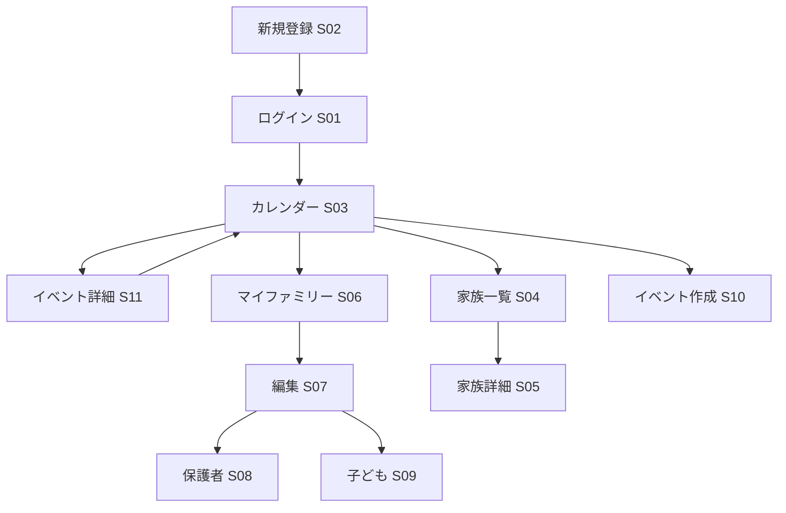

# MinSuke — UI / UX (Loop 01 Draft)

**Status:** Draft — Loop 01 In Progress  
**Date:** 2026-08-10  
**Version:** 0.1

---

## 1. UI Principles

| 原則 | 区分 |
|---|---|
| シンプルで理解しやすい | Confirmed |
| スマートフォン対応（レスポンシブ） | Proposed |
| 家族向け・事務負担軽減を意識 | Proposed |
| アクセシビリティ基本（ラベル、フォーカス） | Proposed |

---

## 2. Target Devices

| デバイス | 優先度 | 方針 |
|---|---|---|
| スマートフォン | 高 | モバイルファースト CSS |
| タブレット | 中 | レスポンシブ |
| デスクトップ | 中 | 旧 MinSuke と同程度 |

---

## 3. MVP Screen List（Proposed）

旧 MinSuke 画面を参考に MVP 候補を定義。

| # | 画面 | パス（案） | ロール | MVP |
|---|---|---|---|---|
| S01 | ログイン | `/login` | 全員 | Yes |
| S02 | 新規登録 | `/register` | 未認証 | Yes |
| S03 | カレンダー（ホーム） | `/calendar` | 認証済 | Yes |
| S04 | 家族一覧（カード） | `/families` | 認証済 | Yes |
| S05 | 家族詳細 | `/families/{id}` | 認証済 | Yes |
| S06 | マイファミリー | `/my-family` | PARENT | Yes |
| S07 | マイファミリー編集 | `/my-family/edit` | PARENT | Yes |
| S08 | 保護者追加/編集 | `/my-family/parents/...` | PARENT | Yes |
| S09 | 子ども追加/編集 | `/my-family/children/...` | PARENT | Yes |
| S10 | イベント作成 | `/events/new` | **ADMIN** | Yes |
| S11 | イベント詳細（**個別参加選択**） | `/events/{id}` | 認証済 | Yes |
| S12 | ログアウト | POST `/logout` | 認証済 | Yes |

---

## 4. Screen Flow（MVP）

---

## 5. Navigation（Proposed）

### 共通ヘッダー（認証済）

| メニュー | 遷移先 | ロール |
|---|---|---|
| カレンダー | S03 | 全員 |
| 家族一覧 | S04 | 全員 |
| マイファミリー | S06 | PARENT |
| ログアウト | — | 全員 |

### モバイル

- ハンバーガーメニューまたはボトムナビ（Open Question）
- タップ領域 44px 以上を目安

---

## 6. Component Patterns

| パターン | 用途 |
|---|---|
| カード一覧 | 家族一覧 |
| フォーム + バリデーション | 登録・編集 |
| カレンダーグリッド | 月間表示 |
| 確認ダイアログ | 削除・キャンセル |
| **参加者チェックリスト** | イベント詳細（自家庭の保護者・子どもを個別選択） |
| フラッシュメッセージ | 成功・エラー通知 |

---

## 7. Form Design

| 項目 | 方針 |
|---|---|
| 必須表示 | `*` またはラベル明示 |
| エラー | フィールド近傍 + 概要 |
| 送信 | POST + PRG（Post-Redirect-Get） |
| 日付 | HTML5 `date` / ネイティブピッカー |

---

## 8. Error Handling（UI）

| 状況 | 表示 |
|---|---|
| バリデーションエラー | フォーム再表示 + メッセージ |
| 定員満員 | イベント詳細に「満員」表示 |
| 権限なし | 403 ページまたはリダイレクト |
| 未認証 | ログインへリダイレクト |

---

## 9. Future UI（Post-MVP）

| 機能 | 画面 |
|---|---|
| 講師ダッシュボード | 担当スケジュール一覧 |
| お知らせ | 一覧・詳細・既読 |
| 管理者 | ユーザー管理、一括登録 |
| 通知バッジ | 未読お知らせ数 |

---

## 10. Technology（UI Layer）

| 項目 | Proposed |
|---|---|
| テンプレート | Thymeleaf |
| スタイル | CSS（モジュール分割可） |
| JS | 最小限（カレンダー補助等） |
| アイコン | Open Question |

---

## 11. Open Questions

- デザインシステム / UI キット採用有無（Bootstrap 等）
- ロゴ・ブランディング素材
- 多言語対応要否
- カレンダーの UI ライブラリ使用有無

---

## 12. Reference

- 旧 MinSuke 画面キャプチャ（git HEAD `docs/images/`）
- `requirements.md` — FR との対応
- `architecture.md` — Thymeleaf SSR
